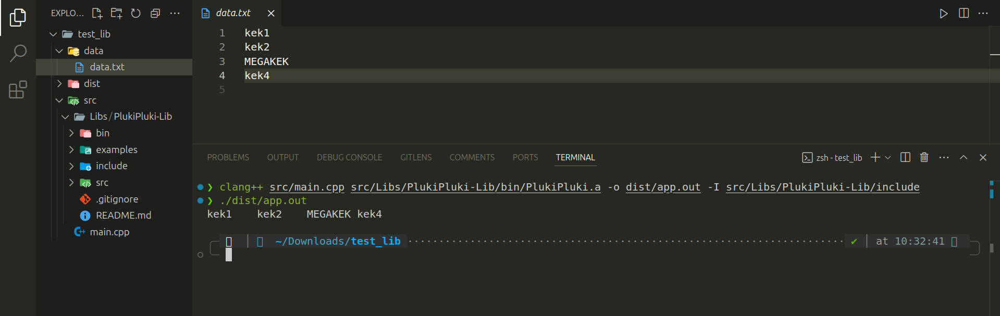

# PlukiPluki

__PlukiPluki C++__ - это оболочкак над библиотекой *__std::fstream__*, сделанная с целью облехчения работы с файломи.

## Использование

Ознакомиться со всеми функциями можно в __[документации](docs/DOCS.md)__

## Примеры

Со всеми доступными примерами можно ознакомиться в каталоге *__examples__*

## Подключение

1. __Создаём новую директорию:__

    ```bash
    mkdir test_lib
    ```

    Переходим в неё, командой:

    ```bash
    cd test_lib
    ```

2. __Создаём файловыу структуру:__

    ```bash
    mkdir build
    mkdir src
    mkdir src/libs
    ```

    Ещё создадим файл main.cpp в директории src

    ```bash
    touch src/main.cpp
    ```

3. __Копируем библиотеку в src/libs__

    Переходим:

    ```bash
    cd src/libs
    ```

    И клонируем репо:

    ```bash
    git clone https://github.com/MaxProger338/PlukiPluki-Lib
    ```

4. __Также создадим каталог data__, в котором будут храниться тестовые файлы

    Возвращаемя в корень проекта

    ```bash
    cd ../../
    ```

    И создаём каталог

    ```bash
    mkdir data
    ```

    В нём сразу создаём файл для обработки

    ```bash
    touch data/data.txt
    ```

    Откроем его, и запишем туда что-то вроде:

    ```txt
    kek1
    kek2
    MEGAKEK
    kek4
    ```

    Вот пример как дожно всё получиться:

    

5. __Пишем код в main.cpp__

    Теперь открываем любой редактор и пишем туда следующий код:

    ```c++
    #include "PlukiPluki.h"

    #include <iostream>
    #include <exception>
    #include <vector>

    using namespace PlukiPlukiLib;

    int main(int argc, char** argv)
    {
        try
        {
            // Создание нашего объекта
            PlukiPluki fb("data/data.txt", std::ios::in);

            /* 
             * Метод indexAllFile индексирует файл
             * и возвращает std::vector со стокоми файда.
             * Здесь мы просто копируем, его в другой, только что, созданный std::vector
            */
            std::vector<std::string> myVec{ fb.indexAll() };

            // Перебираем весь вектор и выводим содержимое в терминал
            for (auto i : myVec)
            {
                std::cout << i << '\t';
            }
            std::cout << '\n';
        }
        // Для обработки ошибок, которые могут возникать в нашем объекте
        catch(const std::exception& e)
        {
            std::cerr << e.what() << '\n';
        }
        // Для обработки каких-то неизвесных ошибок, например memory leak (утечка памяти)
        catch(...)
        {
            std::cerr << "FUCK YOU!!! (said by MEMORY)" << '\n';
        }

        return 0;
    }
    ```

6. __Сборка проекта__

    __Если вы хотите сами собрать библиотеку, читайте в следующем пункте чуть ниже.__

    Я буду показывать на примере уже собранной либы (тоесть файл PlukiPluki.a уже есть в каталоге bin):

    __Сама сборка__
    ```bash
    clang++ src/main.cpp src/libs/PlukiPluki-Lib/bin/PlukiPluki.a -o build/app.out -I src/libs/PlukiPluki-Lib/include
    ```
    Где,

    - __clang++__ - *__[компилятор](https://github.com/llvm/llvm-project)__*

    - __src/main.cpp__ - путь до файла, с точкой входа в наш проект

    - __src/libs/PlukiPluki-Lib/bin/PlukiPluki.a__ - путь до файла, с нашей скомпилированной библиотекой

    - __-I src/libs/PlukiPluki-Lib/include__ - опция, из-за которой нам не нужно будет указвать абсолютный путь до заголовка нашей либы в main.cpp. Вместо это можно будет просто написать имя заголовка и компилятор сам поймёт, что его надо брать из указанной в опци директории

    - __-o build/app.out__ - имя выходного исполняемого файла, который создаст компилятор 

    Теперь можно запустить и проверить результат:

    ```bash
    ./build/app.out
    ```

    Если у вас вышло что-то такое:

    

    #### То Поздравляю вас, у вас получилось!!!

## Самостоятельная сборка библиотеки

Переходим в корень проекта (если вы не там)

И вводим команды

```bash
clang++ -c src/libs/PlukiPluki-Lib/src/PlukiPluki.cpp -o src/libs/PlukiPluki-Lib/bin/PlukiPluki.o -I src/libs/PlukiPluki-Lib/include
```

```bash
clang++ -c src/libs/PlukiPluki-Lib/src/core/FileBase.cpp -o src/libs/PlukiPluki-Lib/bin/FileBase.o
```

```bash
ar rcs src/libs/PlukiPluki-Lib/bin/PlukiPluki.a src/libs/PlukiPluki-Lib/bin/*.o
```

Если вы видите в каталоге bin файл Plukipluki.a:


#### Готово!!! Теперь можно вернуться к предыдущиму шагу!

